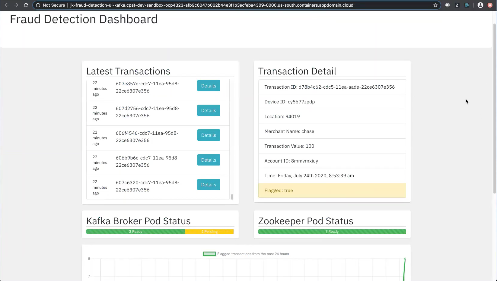

# Fraud Detection App on OpenShift - Developer Experience

When developing the front-end of a microservices architected application, developers need a platform that can:
- facilitate rapid deployments in order to test changes to styling, modify design, or implement new features;
- manage rolling updates to prevent application downtime; and
- offer a way to seamlessly roll back to a previous state.

OpenShift offers excellent developer tools and provides solutions for each of these requirements.

 Iterate rapidly with React and Redux on OpenShift!

One solution is to the use the `oc` command line tool. It provides an `oc new-app` command, which accepts a variety of resources, including source code, in order to automatically deploy an application consisting of labeled, consistent Kubernetes objects. Running the `oc new-app` command also generates OpenShift specific resources, including an image stream.

```
oc new-app quay.io/my-user/my-image:tag
```

An image stream is an OpenShift-only feature that allows for developers to store, tag, and delete related application images using the Kubernetes API - and to use OpenShift's integrated image registry to host images locally. As an example, in our fraud detection application, which consisted of several microservices as well as a Kafka deployment, I used `oc new-app` and `oc import-image` to:
1. Deploy my microservice by referencing its image representation hosted on quay.io
2. Redeploy my microservice with no downtime by running the `oc import-image` command after making changes to the code and pushing those changes, in the form of a tagged image to the quay.io repository. `oc import-image` will pull the latest tagged version of the image originally imported by the `oc new-app` command, and will roll out the new version to the cluster:

```
oc import-image <name-of-image-stream-created-by-oc-new-app-command>
```

There are many approaches to CI/CD on OpenShift, but using the `oc new-app` and `oc import-image` commands may be the simplest for developers looking to get up and running quickly.

Another option is to build a custom OpenShift Pipeline, based on the open source Tekton project. As detailed in [a recent blog post](https://medium.com/@joelkaplan1/gitops-with-istio-tekton-and-argo-cd-on-openshift-4-5e42d22994e3), after gaining some familiarity with Tekton and continuous delivery solutions like ArgoCD, developers can build highly customized CI/CD pipelines which can carry out somewhat advanced DevOps tasks, like automated canary rollouts with OpenShift Service Mesh.

Writing a custom pipeline will require some familiarity with OpenShift's security enhancements, such as role-based access control. For instance, a task in a pipeline may push updated source code to GitHub, or build an image and push it to an external image registry. OpenShift uses service accounts and secrets to manage authentication, as well as the types of actions pods may perform in the cluster.

There is an [additional cli tool](https://docs.openshift.com/container-platform/4.4/cli_reference/developer_cli_odo/creating-a-multicomponent-application-with-odo.html), `odo`, that performs many of the functions of `oc new-app`, but abstracts away some of the Kubernetes details. One example: `odo link` will inject environment variables into an `odo` managed front-end component, based on the values from an `odo` managed back-end component, enabling easy interaction between the application pods.

This post is part of a series detailing aspects of a fraud detection application built on OpenShift. Check out these posts for information on the Strimzi Kafka operator, Prometheus alerting and monitoring, and practical insights from working with Kafka on OpenShift!


